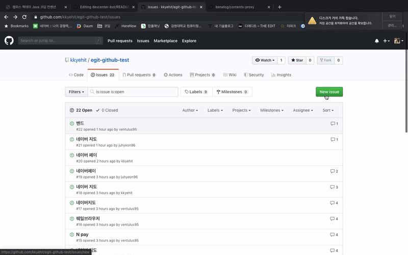

# 게시판 자동 답글봇 만들기

## 주제선정 배경
[네이버 개발자센터 포럼](https://developers.naver.com/forum/list)에는 반복적인 질문들이 많이 올라옵니다.
이에 대한 답변을 자동으로 하는 Bot 프로그램을 만들어서 운영비용을 줄어보고자 합니다.

## 기술 스택
- Java 13
- Spring Boot 2.2
- Spring JDBC
    - [Spring JDBC의 핵심 사용법](https://github.com/benelog/spring-jdbc-tips/blob/master/spring-jdbc-core.md) 참조
- DB:H2db

## 코딩 컨벤션
### Java
https://naver.github.io/hackday-conventions-java/ 을 참고

### Markdown
- 들여쓰기로 스페이스 4칸을 사용

## 결과들

### 진행과정

프로그램 기술 요약
egit을 통해 git-hub API의 JSON구조를 파싱하고, 그 이슈의 제목중 키워드를 찾아서 그 키워드를 분류한뒤에 분류한 특정 Q&A들을 일정한 형식의 답변을 DB에서 꺼내서 자동으로 답글로 다는 봇.

프로그램 기술 세부요약.

특정 키워드는 다음과 같다.

| 타입 | 의미 | keyword |
|---|:---:|:---:|
| `SMART_EDITOR_TYPE` | 스마트에디터 | `네이버 에디터`, `스마트에디터`, `네이버에디터`, `스마트 에디터` |
| `NAVER_APP_TYPE` | 네이버 앱 | `네이버 앱`, `네이버앱` |
| `CLOUD_FUNDING_TYPE` | 크라우드펀딩 | `크라우드펀딩` ,`크라우드 펀딩`|
| `NAVER_PAY_TYPE` | 네이버 페이 |`네이버 페이`, `네이버페이`, `Npay`,` N pay`|
| `MAP_API_TYPE` | 네이버지도 |`네이버지도`, `지도`, `네이버맵`, `NaverMap`, `네이버 지도`|
| `BAND_API_TYPE` | 밴드 |`네이버밴드`, `밴드`, `네이버 밴드`|
| `WHALE_TYPE` | 웨일 |`네이버 웨일`, `웨일`, `웨일브라우저`, `네이버웨일`, `네이버웨일브라우저`|

이 키워드를 바탕으로 title에 있는지 확인을 해본다. 만약 있다면, 그 Issue를 특정 타입을 갖게한다.

각 타입으로 BotRequest로 객체화 시키고 그 ID 값에따라서
Classifer를 통해 message출력되는 DB의 Comment 메세지 값들을 table에서 ID값에 맞는 comment값을 출력하게한다.

그리고 그 출력문을 Message을 egit을 통해서 createComment를 통해서 그 출력 메세지를 issue에 댓글 생성한다.

### 결과

이슈를 입력하면 서버가 가동되어진 후 20초의 한번씩 메소드를 실행시키면서 그 20초안에 새로운 글이 생긴 경우 봇이 작동하게 한다.

시연영상

## 기술 설계도

## 기술적인 추가사항

-Dgithub.token='' 으로 옵션 추가하면 github token로 갈아끼울수 있습니다. (파일에 있는것보다 -D 옵션이 우선순위가 높습니다.)
-Dspring.h2.console.settings.web-allow-others=true

## 서버 배포 방식

예상보다 서버 배포 방식이 좀 어렵지 않아서 스프링 부트의 유용성을 많이 느낄 수 있었습니다.  
   
1. 빌드를 하기 위해서는 gradle의 build를 이용합니다. build.gradle에 밑의 코드를 이용하면,

`bootjar {
	archiveFileName = 'QA.jar'
	archiveVersion = "0.0.0"
}
`
빌드시의 .jar파일의 파일명을 지정하거나, 버젼명을 따로 지정할 수 있습니다.
단, 지정하지 않을시 알아서 버젼과 이름을 붙혀줍니다. 예를 들면 이런식으로요.
`devcenter-bot-0.0.1-SNAPSHOT.jar`
명령어인 `./gredlew bootjar`를 이용하거나 

이미지 속의 bootjar를 이용합니다.

2. 이러면 파일이 build 폴더 밑에 저장이 됩니다.

3. 이걸 이제 서버에 올리는 작업을 해야합니다. 그걸 ssh를 통해서 옮기던가 혹은 ftp서버를 통해서 옮기는 방법이 있었는데 저는 ssh를 통해서 옮기게 되었습니다.     
scp의 경우 `scp 파일주소 [ID명]@[IP주소]:[서버의폴더경로]` 를 통해서 옮겨줍니다.
4. 실행 방법은 그 폴더 주소로 이동해서 java -jar [파일명.jar]를 이용합니다. 그려면 실행이 뿅하고 됩니다.

그러면 서버 배포 완료!

물론 H2-console을 가기위해서는 build시의 수정사항이 있어하고, 이렇게하면 외부 서버에서도 Spring-boot가 잘 작동됩니다.
