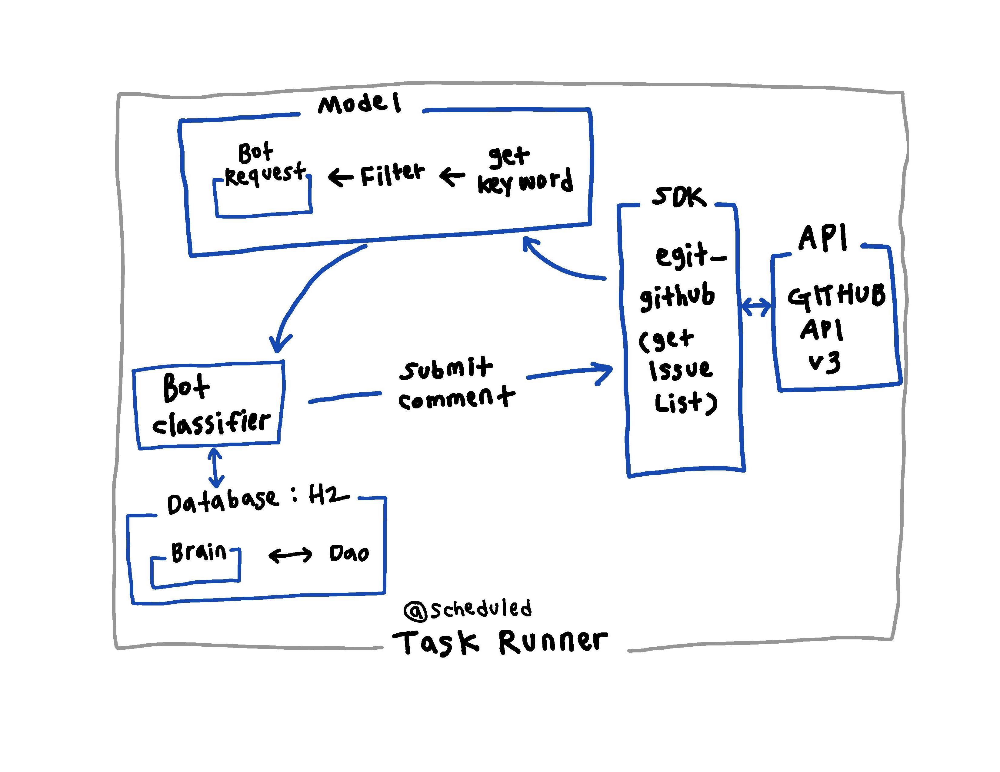

<h1  align="center">devcenter-bot</h1>

  

 게시판 자동 답글 봇 

  

&nbsp;

<!-- TABLE OF CONTENTS -->

## Table of Contents

  

*  [About the Project](#about-the-project)
	* [주제선정 배경](#주제선정-배경)
	*  [기술 스택](#기술-스택)
	*  [Coding Conventions](#coding-conventions)
*  [Getting Started](#getting-started)
	* [Dependencies](#dependencies) 
*  [Details](#details)
* 	*  [Description](#description)
	*  [Keyword For Classify](#keyword-for-classify) 
	*  [Architecture](#architecture)
	*   [Demo](#demo)
	*  [Deploy](#deploy)
	*  [추가사항](#추가사항)
*  [Contact](#contact)

  

&nbsp;

## About The Project

2019 Naver Campus Hackday Winter 
<b>게시판 자동 답글 봇 만들기</b>
 

### 주제선정 배경

[네이버 개발자센터 포럼](https://developers.naver.com/forum/list)에는 반복적인 질문들이 많이 올라옵니다.

이에 대한 답변을 자동으로 하는 Bot 프로그램을 만들어서 운영비용을 줄어보고자 합니다.

  
&nbsp;
### 기술 스택

- Java 13

- Spring Boot 2.2

- Spring JDBC

-  [Spring JDBC의 핵심 사용법](https://github.com/benelog/spring-jdbc-tips/blob/master/spring-jdbc-core.md) 참조

- DB:H2db

  
  
&nbsp;
### Coding conventions

<b> Java </b>

https://naver.github.io/hackday-conventions-java/ 

<b> Markdown </b>

- 들여쓰기로 스페이스 4칸을 사용

 &nbsp;
## Getting Started

### Dependencies

  
    dependencies {
	    implementation 'org.springframework.boot:spring-boot-starter-jdbc'
	    implementation 'org.springframework.boot:spring-boot-starter-web'
	    implementation("com.h2database:h2")
	    developmentOnly 'org.springframework.boot:spring-boot-devtools'
	    testImplementation('org.springframework.boot:spring-boot-starter-test') {
		    exclude group: 'org.junit.vintage', module: 'junit-vintage-engine'
	    }
	    compile "org.eclipse.mylyn.github:org.eclipse.egit.github.core:2.1.5"
	}
	
	test {
		useJUnitPlatform()
		def token = System.getProperty("github.token")
		println("Github Access Token : ${token}")
		systemProperty "github.token", token
	}
	
 &nbsp;
## Details
### Description

 - API : [github api v3]([https://developer.github.com/v3/](https://developer.github.com/v3/))
 - SDK : [egit-github]([https://github.com/eclipse/egit-github](https://github.com/eclipse/egit-github))
 
 먼저, egit-github 로 얻은 Issue 의 제목에서 키워드를 추출 및 분류합니다. 그 키워드를 기준으로 Database에 접근하여 해당되는 답변을 가져와, comment로 설정합니다. Issue List를 불러오는 작업은, Spring에서 제공하는 스케줄링으로 구현하였습니다.
 
First, we extract and classify <b>keyword</b> from Github Issue List using 'egit-github'. Then we sets comment for the Bot, access to Database on a <b>keyword</b> basis. For calling Github Issue List, Bot is actioned by scheduling of Spring.

 &nbsp;
### Keyword For Classify

| Type | 의미 | Keyword |
|---|:---:|:---:|
| `SMART_EDITOR_TYPE` | 스마트에디터 | `네이버 에디터`, `스마트에디터`, `네이버에디터`, `스마트 에디터` |
| `NAVER_APP_TYPE` | 네이버 앱 | `네이버 앱`, `네이버앱` |
| `CLOUD_FUNDING_TYPE` | 크라우드펀딩 | `크라우드펀딩` ,`크라우드 펀딩`|
| `NAVER_PAY_TYPE` | 네이버 페이 |`네이버 페이`, `네이버페이`, `Npay`,` N pay`|
| `MAP_API_TYPE` | 네이버지도 |`네이버지도`, `지도`, `네이버맵`, `NaverMap`, `네이버 지도`|
| `BAND_API_TYPE` | 밴드 |`네이버밴드`, `밴드`, `네이버 밴드`|
| `WHALE_TYPE` | 웨일 |`네이버 웨일`, `웨일`, `웨일브라우저`, `네이버웨일`, `네이버웨일브라우저`|

&nbsp;
 1. Issue의 title을 해당되는 Type에 matching : `Keyword` 기준
 2. matching 성공 시 -> 해당 `Type`을 가짐
 3. [BotRequest]([https://github.com/NAVER-CAMPUS-HACKDAY/devcenter-bot/blob/master/src/main/java/com/naver/hackday/devcenterbot/model/BotRequest.java](https://github.com/NAVER-CAMPUS-HACKDAY/devcenter-bot/blob/master/src/main/java/com/naver/hackday/devcenterbot/model/BotRequest.java)) 에서 `Type`에 매핑된 id 값을 기준을 Database에 접근
 4. 해당 id로 등록된 comment 를 egit-github 를 통해 출력

&nbsp;
### Architecture

 

&nbsp;
### Demo

 
Issue를 입력 -> 서버 가동 -> 20초에 한번씩 검사 -> 20초안에 새로운 글이 생긴 경우 봇이 작동

  

### Deploy

1. 빌드를 하기 위해서는 gradle의 build를 이용합니다.

<b>build.gradle</b>

    bootjar {
    
	    archiveFileName = 'QA.jar'
    
	    archiveVersion = "0.0.0"
    
    }

&nbsp;
빌드시의 .jar파일의 파일명을 지정하거나, 버젼명을 따로 지정할 수 있습니다.

지정하지 않은 경우 (ex) :

`devcenter-bot-0.0.1-SNAPSHOT.jar`

명령어인 `./gredlew bootjar`를 이용하거나

이미지 속의 bootjar를 이용합니다.

  
&nbsp;
2. 파일 저장 위치

&nbsp;
3. 서버에 올리는 작업
FTP 서버와 SSH를 이용하는 방법 중 SSH 선택합니다.

scp : `scp 파일주소 [ID명]@[IP주소]:[서버의폴더경로]` 를 통해서 옮깁니다.

&nbsp;
4. <b>실행 </b>
 

    java -jar [파일명.jar]

  
&nbsp;
ps) 물론 H2-console을 가기위해서는 build시의 수정사항이 있어하고, 이렇게하면 외부 서버에서도 Spring-boot가 잘 작동됩니다.
  
  
&nbsp;
### 추가사항

  

-Dgithub.token='' 으로 옵션 추가하면 github token로 갈아끼울 수 있습니다. (파일에 있는것보다 -D 옵션이 우선순위가 높음)

    Dspring.h2.console.settings.web-allow-others=true

  
&nbsp;
## Contact

 - Sanghyuk Jung ([benelog]([https://github.com/benelog](https://github.com/benelog)))
 - SangJun Lee ([sjstyle]([https://github.com/sjstyle](https://github.com/sjstyle)))
 - kkyehit ([kkyehit]([https://github.com/kkyehit](https://github.com/kkyehit)))
 - Juhyeon ([juhyeon96]([https://github.com/juhyeon96](https://github.com/juhyeon96)))
 - 이창섭 ([ventulus95]([https://github.com/ventulus95](https://github.com/ventulus95)))

  

